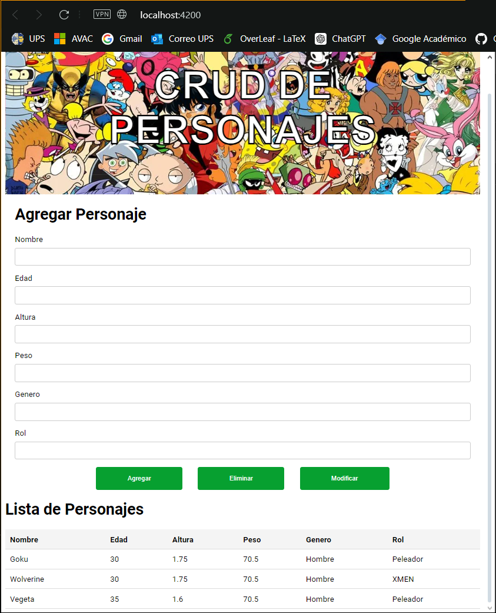
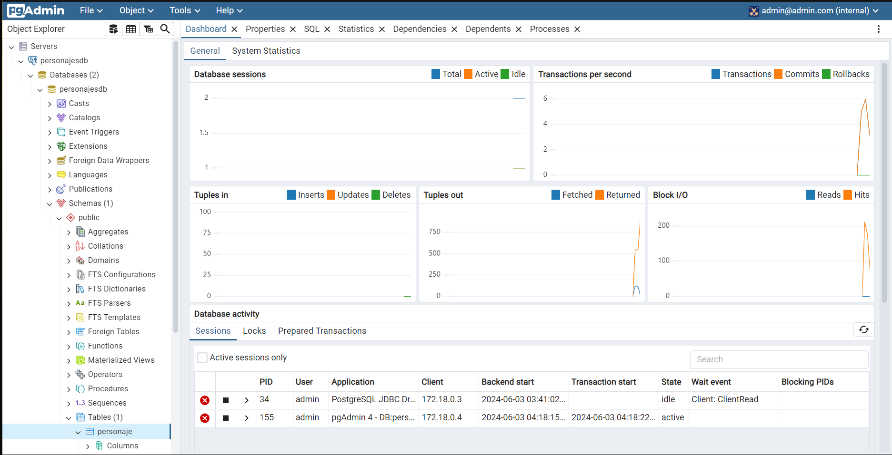
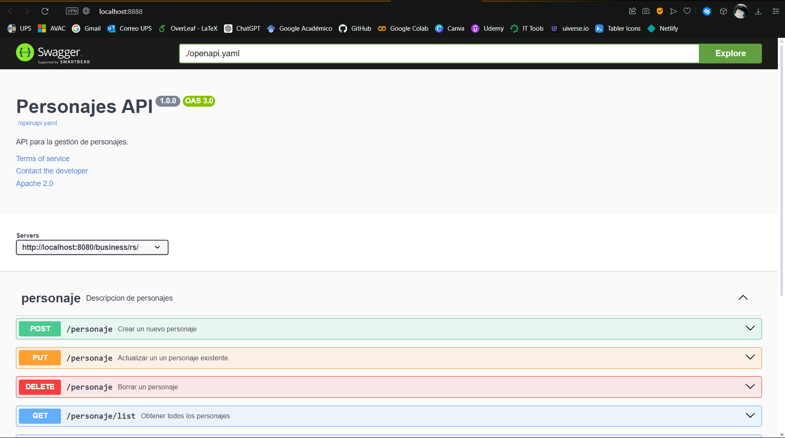
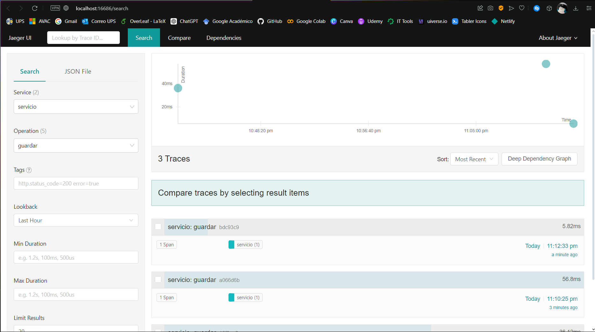
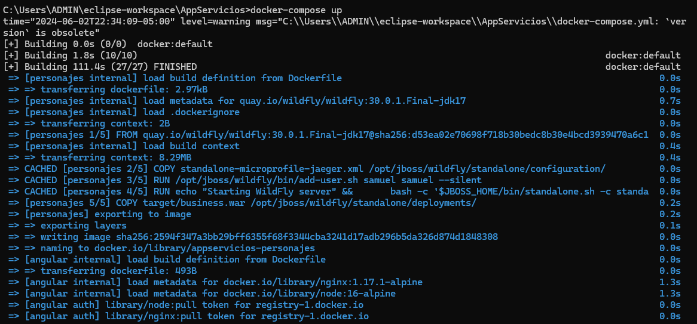

# AppServicios

## Descripción
Este proyecto utiliza Docker Compose, WildFly, Angular, PostgreSQL, Swagger y Jaeger para crear una arquitectura de microservicios robusta. Se centra en la gestión de personajes, permitiendo operaciones CRUD a través de una interfaz amigable.

## Tecnologías Utilizadas

### Angular
  
**Angular** es utilizado para el frontend, facilitando la creación de interfaces de usuario dinámicas y reactivas.

### WildFly
**WildFly** actúa como servidor de aplicaciones para el backend, proporcionando un entorno escalable y eficiente para ejecutar aplicaciones Java.  

### PostgreSQL
  
**PostgreSQL** se emplea como sistema de gestión de bases de datos, destacando por su robustez y fiabilidad en el manejo de grandes volúmenes de datos.

### Swagger
  
**Swagger** es utilizado para diseñar, construir y documentar las APIs RESTful de manera interactiva, mejorando la interfaz de desarrollo y facilitando la integración y pruebas.

### Jaeger
  
**Jaeger** se utiliza para el seguimiento y monitoreo de microservicios, ayudando a identificar y solucionar problemas en ambientes distribuidos.

### Docker
  
**Docker** y **Docker Compose** son esenciales para la orquestación y despliegue de contenedores, permitiendo una gestión eficiente del ciclo de vida de la aplicación.

## Configuración y Ejecución
Para ejecutar este proyecto, asegúrate de tener Docker y Docker Compose instalados. Luego, clona el repositorio y ejecuta:

```bash
docker-compose up
